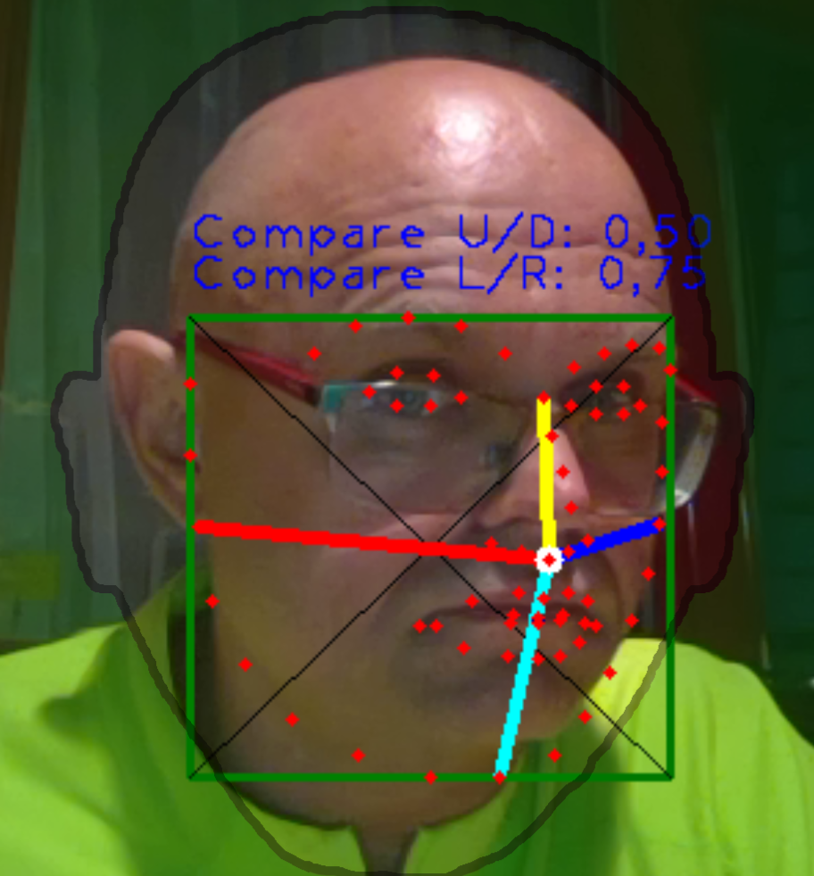

# OCV-face68-2DOF-Rotation

OpenCV Code Beispiele für Winkelberechnung.
C# Code in Unity. 
Beispiele für die LV Interface.



## Winkel-1 Kopfneigung "ATAN"
```
Point centerPoint = new Point(points[pointUnten].x, points[pointUnten].y);
Point winkelPoint = new Point(points[pointOben].x, points[pointOben].y);
Imgproc.line(rgbMat, centerPoint, winkelPoint, new Scalar(255, 128, 128), 2);
double faceAngle = Math.Atan2(winkelPoint.y - centerPoint.y, winkelPoint.x - centerPoint.x) * 180.0f / Math.PI + 90.0f;
DMT.StaticStore.FaceAngle = faceAngle;
```

## Winkl-2 Kopfbewegung rauf/runter
```
float raufDistanz = Vector2.Distance(points[pointOben], points[pointMitte])*1.40f;
float runterDistanz = Vector2.Distance(points[pointMitte], points[pointUnten]);

Imgproc.line(rgbMat, new Point(points[pointOben].x, points[pointOben].y), new Point(points[pointMitte].x, points[pointMitte].y), new Scalar(255, 255, 0), 3);
Imgproc.line(rgbMat, new Point(points[pointMitte].x, points[pointMitte].y), new Point(points[pointUnten].x, points[pointUnten].y), new Scalar(0, 255, 255), 3);
float compareDistanzRaufRunter = raufDistanz / (raufDistanz + runterDistanz);

DMT.StaticStore.upDownFace = compareDistanzRaufRunter;

String headTxtUpDown = "Compare U/D: " + compareDistanzRaufRunter.ToString("0.00");
Imgproc.putText(rgbMat, headTxtUpDown, new Point(faceBBMin.x, faceBBMin.y) + new Point(0, -25), Imgproc.FONT_HERSHEY_PLAIN, 1.2, new Scalar(0, 0, 255), 1, Imgproc.LINE_4, false);
```

### Optimierung "Mundöffnung"
```
compareDistanzRaufRunter = raufDistanz / (raufDistanz + runterDistanz- mouthDistanz);
DMT.StaticStore.upDownFace = compareDistanzRaufRunter;
```

## Winkel-3 Kopfbewegung rauf/runter
```
float raufDistanz = Vector2.Distance(points[pointOben], points[pointMitte])*1.40f;
float runterDistanz = Vector2.Distance(points[pointMitte], points[pointUnten]);

Imgproc.line(rgbMat, new Point(points[pointOben].x, points[pointOben].y), new Point(points[pointMitte].x, points[pointMitte].y), new Scalar(255, 255, 0), 3);
Imgproc.line(rgbMat, new Point(points[pointMitte].x, points[pointMitte].y), new Point(points[pointUnten].x, points[pointUnten].y), new Scalar(0, 255, 255), 3);

float compareDistanzRaufRunter = raufDistanz / (raufDistanz + runterDistanz);
DMT.StaticStore.upDownFace = compareDistanzRaufRunter;

String headTxtUpDown = "Compare U/D: " + compareDistanzRaufRunter.ToString("0.00");
Imgproc.putText(rgbMat, headTxtUpDown, new Point(faceBBMin.x, faceBBMin.y) + new Point(0, -25), Imgproc.FONT_HERSHEY_PLAIN, 1.2, new Scalar(0, 0, 255), 1, Imgproc.LINE_4, false);
```

## Punkt Konstanten
```
private const byte pointMitte = 33; // Nose
private const byte pointOben = 27;
private const byte pointUnten = 8;
private const byte pointLeft = 2;
private const byte pointRight = 14;

const byte mouthOben = 62;
const byte mouthUnten = 66;
```


